# Chat application - final project

## Presentation

For this assessment, we are going to do a user Experience presentation of our space chat. 

### Login Screen 

We created an intuitive and UX design welcome screen where we can simply login with dex

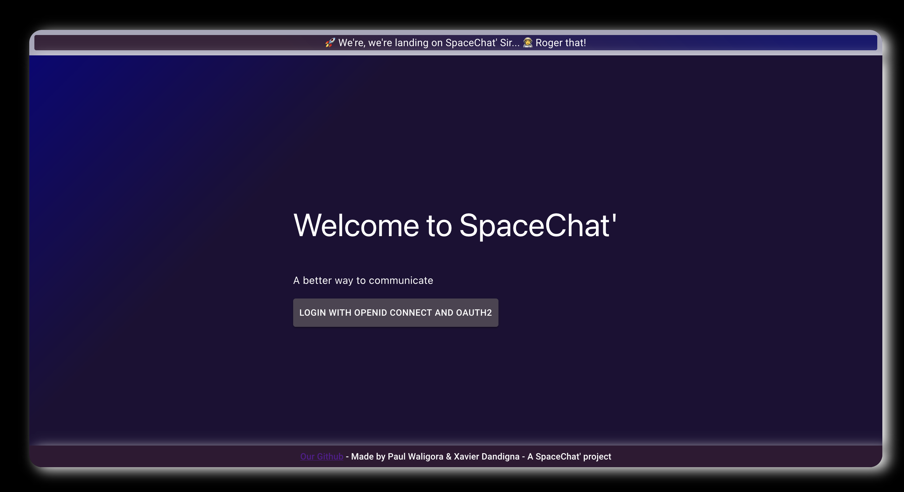


### Connexion and Welcome Screen 

After having Login, our code check if you have already been on this application. If you have already been in this application, you are connected and your email and id are set in the usecontext. Else, if you have never been on this application, it will create a user with your email and an id in the databse. 
Here is the code that does this: 

```js
if (!users.filter(user => user.username == payload.email).length){
          // the user doesn't exist, we have to add him in the data base
          const {data: user} = await axios.post('http://localhost:3001/users', {
            username: payload.email
          })
          data.email = user.username
          data.id = user.id 
        } else {
          // the user already exist, but we have to add the id and the email of the user in the cookie
          const theUser = users.find(user => user.username == payload.email)
          data.email = theUser.username
          data.id = theUser.id
        }
```

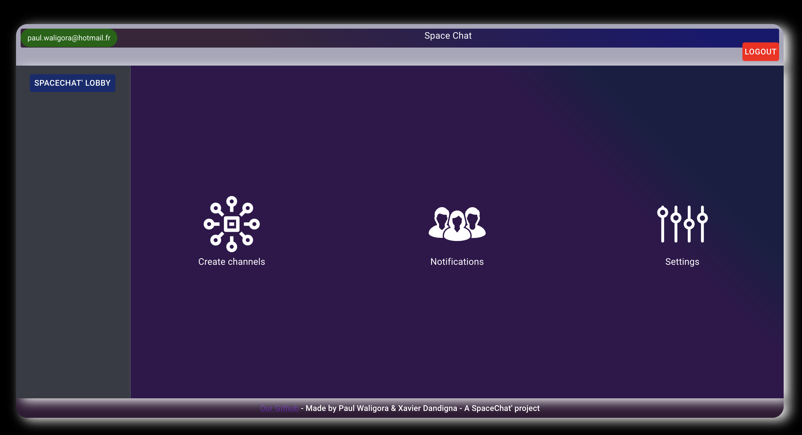

The first time you login, you arrive to this page. you have two choices here: 

- Create a new channel 
- check your notifiactions

Lets now create a new channel and send some messages... 

### Create a new Channel

When we create a new channel, we have to set a nem for the channel like here: 

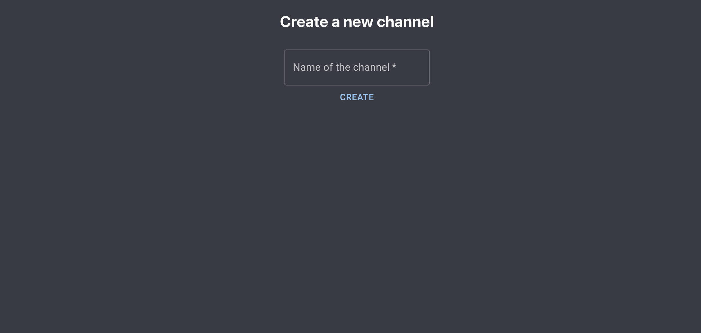

Lets now create multipe channels named "channel 1, 2, 3": 

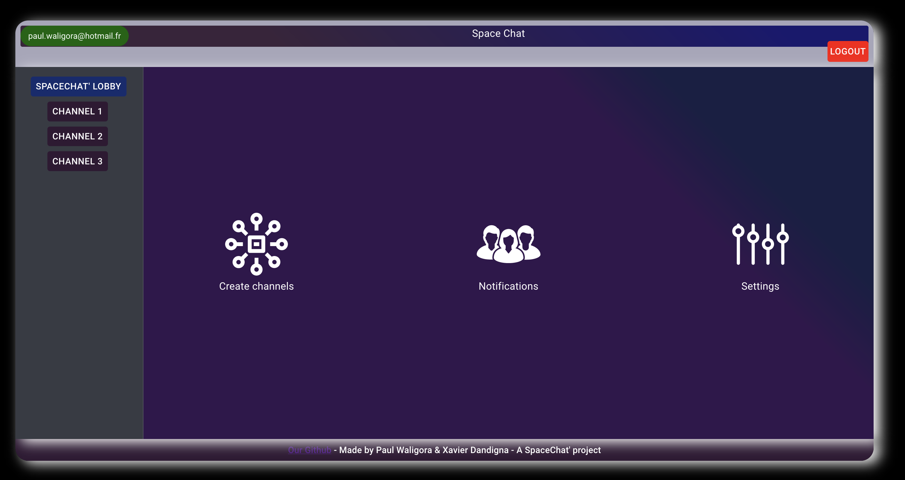

We can see all the channels created on the left of the screen. Notice that, on an other account, you won't see these channels because you were not invited. 


### Channel settings 

Once you are in a channel, you can check the settings of the channel (on the top left corner of the screen)

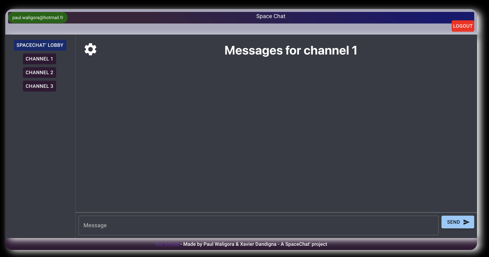

When you open the settings, a modal window open where you can do multiple things: 

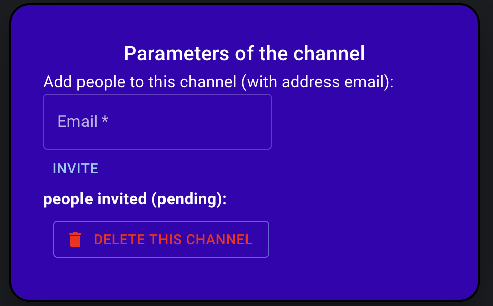

So you can delete the channel or add new people to this channel with their email address. Lets add a new people to the channel: 

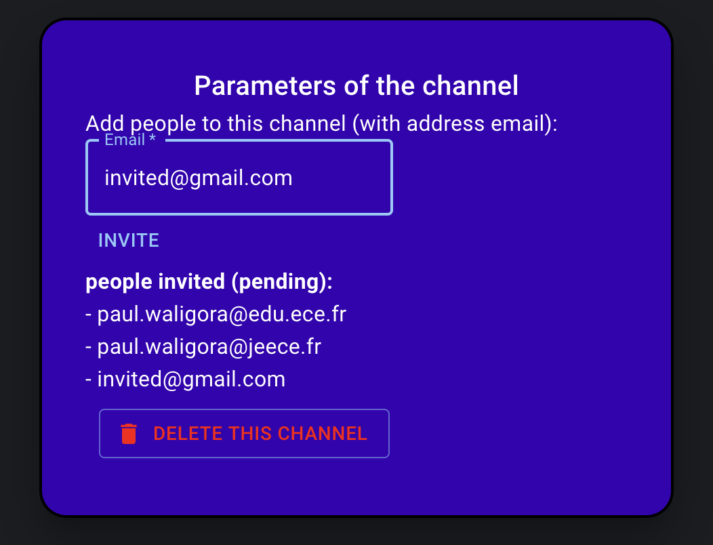


When we add new people, we can see all the people we invited in the list (however these people will have to accept whether they want to join the channel).
Lets now see what happen on paul.waligora@edu.ece.fr account: 

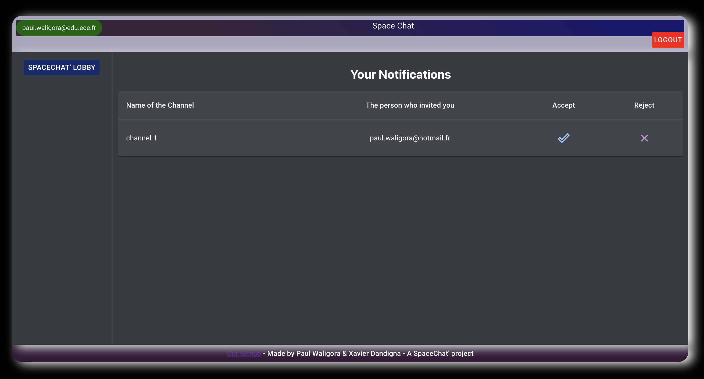

When we go to the other account in notifications page, we can accept or reject the invitation to the new channel. Onthis notification page, we can see the name of the channel and the person who invited me. 
If we accept, we become members of the channel and the notification disapear : 

 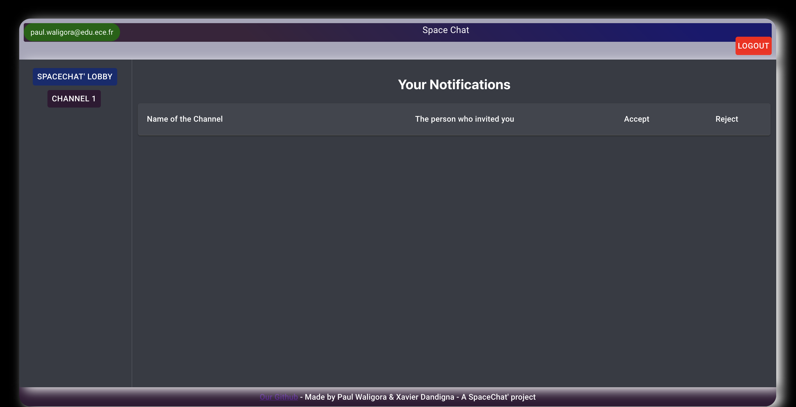


### Delete and modify messages 

In our app, we have the possibility to change or delete a message. You can delete a message thanks to the thrash button on the right or modify it with the settings button. 
Lets write some messages and delete a message: 

 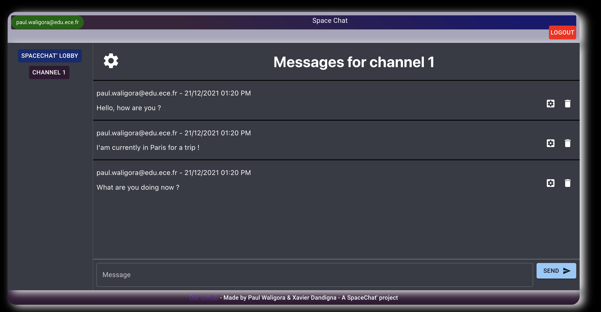

Lets now delete the first message: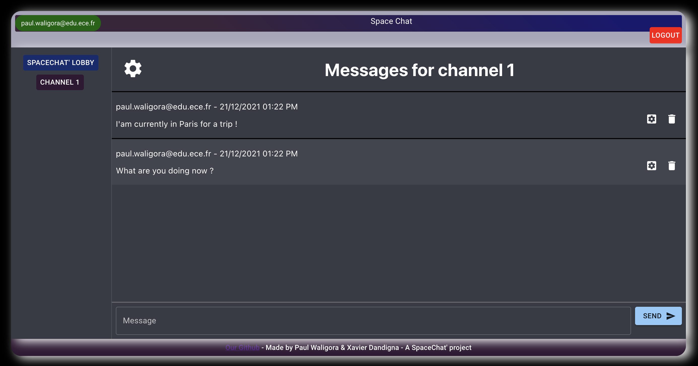


We also can modify a message by clicking on the settings button on the right of the message, like this : 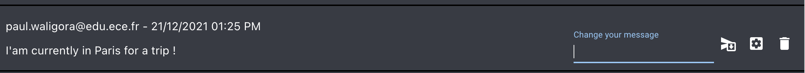

And let change the message to "I am currently in London for a trip !": 


## Usage

*how to start and use the application, run the tests, ...*

* Clone this repository, from your local machine:
  ```
  git clone https://github.com/adaltas/ece-webtech-2021-fall.git webtech
  cd webtech/courses/webtech/project
  ```
* Install [Go](https://golang.org/) and [Dex](https://dexidp.io/docs/getting-started/). For example, on Ubuntu, from your project root directory:   
  ```
  # Install Go
  apt install golang-go
  # Download Dex
  git clone https://github.com/dexidp/dex.git
  # Build Dex
  cd dex
  make
  make examples
  ```
  Note, the provided `.gitignore` file ignores the `dex` folder.
* Register your GitHub application, get the `clientID` and `clientSecret` from GitHub and report them to your Dex configuration. Modify the provided `./dex-config/config.yml` configuration to look like:
  ```yaml
  - type: github
    id: github
    name: GitHub
    config:
      clientID: xxxx98f1c26493dbxxxx
      clientSecret: xxxxxxxxx80e139441b637796b128d8xxxxxxxxx
      redirectURI: http://127.0.0.1:5556/dex/callback
  ```
* Inside `./dex-config/config.yml`, the front-end application is already registered and CORS is activated. Now that Dex is built and configured, you can start the Dex server:
  ```yaml
  cd dex
  bin/dex serve dex-config/config.yaml
  ```
* Start the back-end
  ```bash
  cd back-end
  # Install dependencies (use yarn or npm)
  yarn install
  # Optional, fill the database with initial data
  bin/init
  # Start the back-end
  bin/start
  ```
* Start the front-end
  ```bash
  cd front-end
  # Install dependencies (use yarn or npm)
  yarn install
  # Start the front-end
  yarn start
  ```

## Author

- Paul Waligora 
- Xavier Dandigna

## Tasks

Project management

* Naming convention   
  1.5/2, we tried to make our code the most visible possible with easy name of file or variables
* Project structure   
  2/4, we separated everything we could separate in different folders 
* Code quality   
  3/4 we used formater with vs code to help us format our documents better
* Design, UX   
  3/4, we used material UI for a lot of components, however the overall style doesn't follow
* Git and DevOps   
  3/4, We used branch and commit during all the project in order to follow our progression. furthermore we modified unit test for our project

Application development

* Welcome screens   
  2/4: we made something simple where we easily can access to different pages
* New channel creation   
  5/6, we can create a channel, it persist to the database, we can also set the name of the channel
* Channel membership and access   
  3/4 when we create a new channel, the channel is associated with the Id of the person who created the channel. However, we didn't implemented token access. 
* Ressource access control   
  3/4, the user can access only to his channel or to the channel where he was invited 
* Invite users to channels   
  6/6, we can invite who ever we want with their adress mail 
* Message modification   
  2/2, we can easily modificate a message
* Message removal   
  2/2, we also easily can remove a message
* Account settings   
  0
* Gravatar integration   
  0
* Avatar selection   
  0
* Personal custom avatar   
  0

## Bonus

4, We have a notification page where we can accept or not if we want to go to a channel
